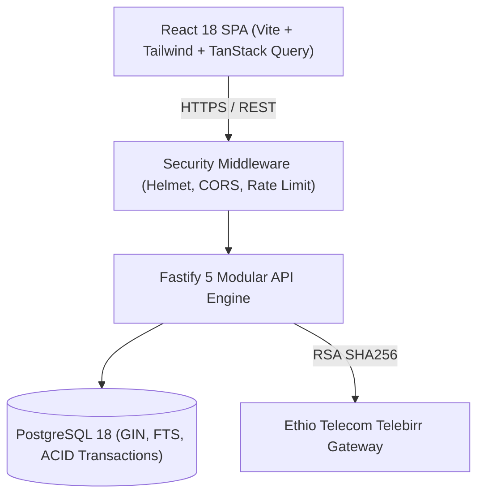

# Betoch System Architecture

## 1. System Overview

Betoch is architected as a high-performance **modular monolith** optimized for developer velocity, operational reliability, and relational data integrity. It balances low latency and high concurrency with strict security boundaries.

## 2. Core Architectural Patterns

### 2.1 Backend: Fastify Modular Monolith
- **Plugin Encapsulation:** Domain modules (`auth`, `properties`, `applications`, `contracts`, `commissions`, `payments`, `admin`) are isolated as Fastify plugins.
- **Ajv / Zod Schema Validation:** Inputs are validated at the route boundary before hitting controllers.
- **Connection Pooling:** PostgreSQL connection pool with connection timeouts and slow query warnings.
- **ACID Transactions with Row-level Locking:** Critical workflows like rental completion use `SELECT ... FOR UPDATE` row locks to prevent race conditions (two renters confirming the same apartment).

### 2.2 Frontend: Reactive Client Architecture
- **Server State Management:** TanStack Query v5 manages all remote entity states, caching, invalidation, and background synchronization.
- **Client Bundle Footprint:** Initial compressed bundle is <110 kB.
- **Type Safety:** Shared validation schemas and domain enums prevent API drift.

### 2.3 Storage Architecture
- **Public Assets:** Property photos stored in `uploads/properties/` and served with cache-control headers.
- **Private Vault:** Landlord title deeds (*Carta*) and Fayda National ID documents stored in private directories accessible only through administrative authorization.
