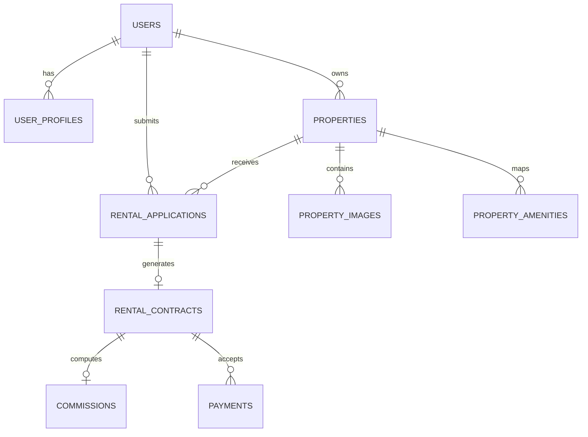

# Betoch Database Specification (PostgreSQL 18)

## 1. Relational Entity Overview

Betoch employs a strictly normalized PostgreSQL relational schema designed for ACID transactions, relational integrity, and performant search queries.



## 2. Table Indexing & Full-Text Search Strategy

### Full-Text Search (PostgreSQL GIN)
The `properties` table incorporates a generated `TSVECTOR` column automatically computed from:
- Property title
- Description
- Neighborhood (e.g. Bole Atlas, Kazanchis, CMC)
- Sub-city (e.g. Bole, Kirkos, Yeka)
- Property type

An index of type `GIN(search_vector)` provides millisecond search response times across large listing catalogs without external search engine overhead.

### Trigram Fuzzy Matching (`pg_trgm`)
The `pg_trgm` extension is enabled to handle transliterated Amharic and English neighborhood spelling variations (e.g., "Piazza" vs "Piassa", "Kazanchis" vs "Kazanchise").

### Transaction Row-Level Locking
When finalizing a rental agreement, the property row is locked via:
```sql
SELECT id, listing_status FROM properties WHERE id = $1 FOR UPDATE;
```
This guarantees that two prospective tenants cannot simultaneously confirm a lease for the same property.
